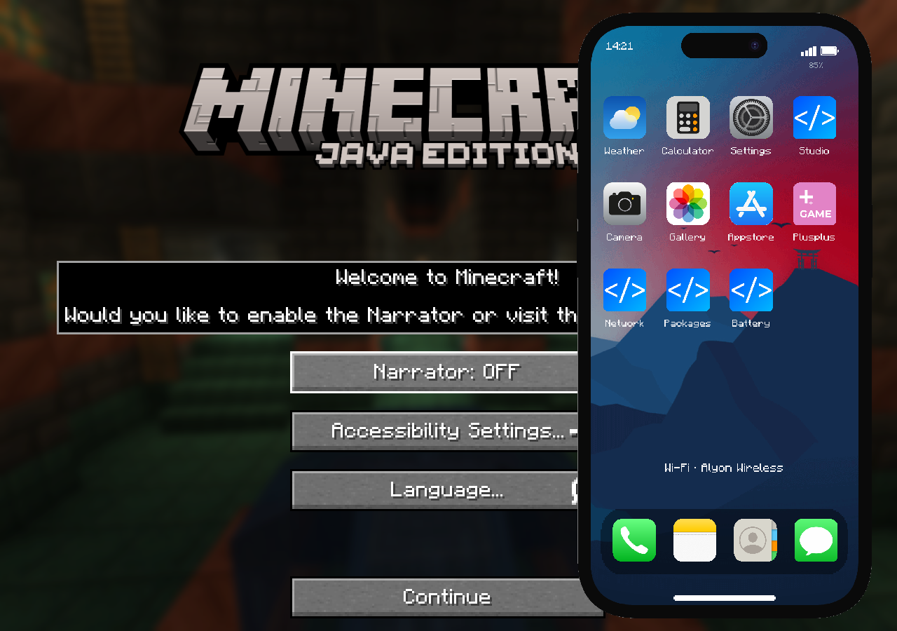
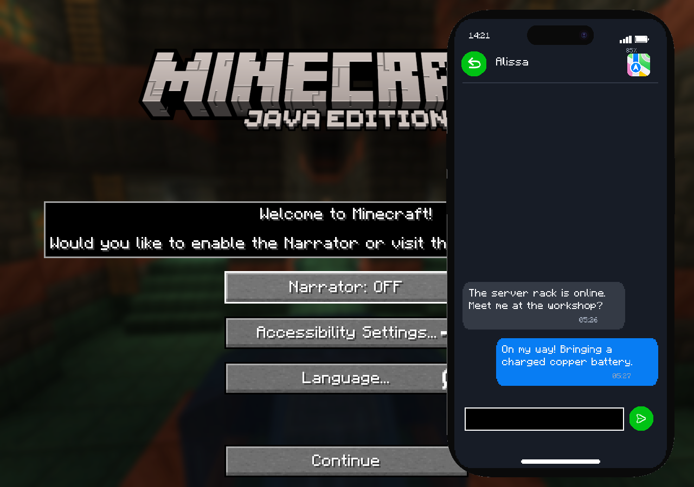
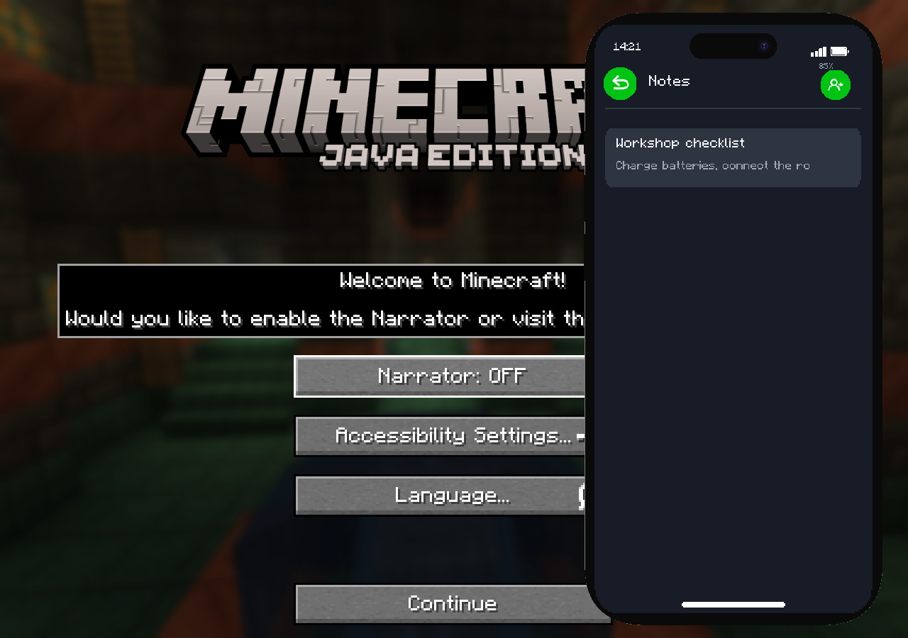
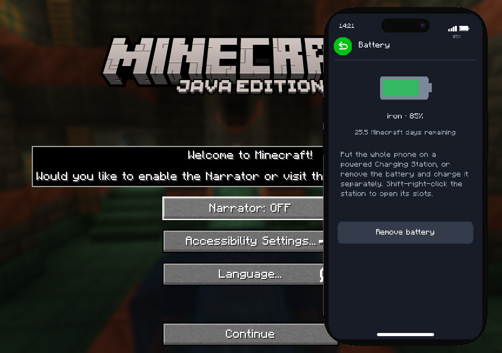

# Validation — 0.1.0-alpha.2

Validated the recovered source on 2026-10-07 with Java 21 / Minecraft 1.21.1 / NeoForge 21.1.252.

| Check | Result |
|---|---|
| `gradlew build` | Passed; 33 JUnit tests, zero failures/errors |
| `gradlew runGameTestServer` | All seven required Minecraft tests passed |
| `gradlew runClient -PedenUiTest` | Fifteen phone pages rendered; scaled Messages dock input passed |
| Original phone/SIM model loading | No E.D.E.N./SPhone missing model textures after migration/atlas fixes |
| Runtime JAR integrity | JSON parsed; 255 original phone-model elements retained; optional API binaries and UI test driver excluded |
| Uploaded historical ZIP | SHA256 unchanged: `f3adb8e961c823b11ed50e1c8d8ff7b574ea3a570a242afb83702c3b594e8365` |

Game tests covered registration/SDK discovery, native SavedData, desktop identity/SIM relocation, loose-battery charging, whole-phone charging of an installed battery, direct item FE simulation/transfers, refusing charging after battery removal, block FE capability, Ethernet/WAN cable cuts, gateway power loss, rack inventory/owner/ciphertext persistence, encrypted cartridge export/import, WiFi keys and SIM carriers.

Unit tests covered the requested lifetimes and tick drain, creative power, world serialization/migration, calls and participant roles/cleanup, package encryption/wrong keys/tampering, bounded compressed snapshots, and suppressing proximity microphone forwarding before looking up an offline call peer. GUI fixtures covered Home, Messages, Conversation, Contacts, Contact, Notes, Note Editor, Calculator, Weather, Phone, Network, Packages, App Store, Wallpapers and Battery. Sample screenshots below use fixture data, rather than a multiplayer playtest.

The managed execution environment required a local NeoForm Runtime fallback for missing `ProcessHandle` executable metadata and an Xvfb software rendering session. These changes are outside the repository and outside the delivered mod. The normal Gradle configuration and GitHub workflow are retained.

**Still unverified:** live two-player Simple Voice Chat audio and full Flux Networks / Create Power Grid / AE2 / OC2R modpack behavior. Compile-time API and standard FE/item capability checks are narrower than live interoperability. The software-rendered environment had no audio device; the GUI check does not validate audible ringing or voice quality. See README for the current in-game WAN, package encryption and integration boundaries.

Runtime JAR SHA256: `219f4dce5158ebcb31766e7cb87a2faa4e9dc059cc76b77fd054b76ee535dddb`.
